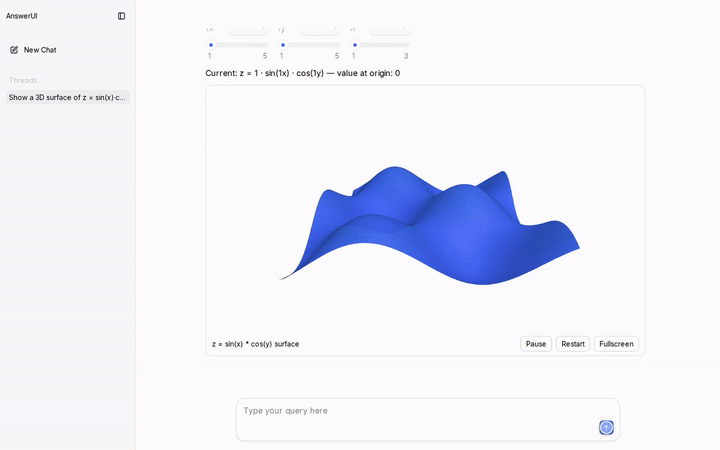
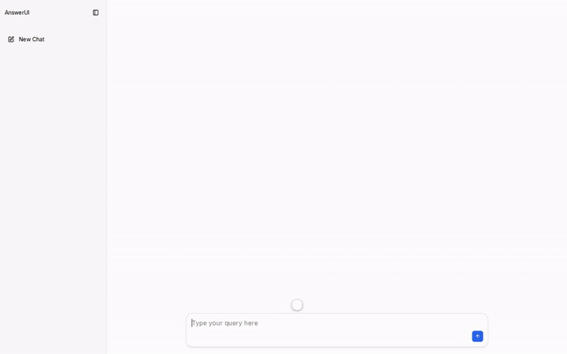

<p align="center">
  <picture>
    <source media="(prefers-color-scheme: dark)" srcset=".github/assets/logo-dark.png">
    
  </picture>
</p>

<p align="center">
  <strong>Answers you can use, not just read.</strong> Open source, any AI model.<br>
  Ask how something works and get a live 3D scene you can steer.
</p>

<p align="center">
  <a href="https://github.com/0xcro3dile/answerui/actions/workflows/ci.yml"></a>
  <a href="https://www.npmjs.com/package/answerui-app"></a>
  <a href="LICENSE"></a>
</p>

<p align="center">
  
</p>

<p align="center"><a href=".github/assets/scenes-3d.mp4">Watch in full quality</a> · answers by Kimi K3, sped up 1.2×</p>

---

AnswerUI is an open-source alternative to ChatGPT's Intelligent UI. It answers with interfaces instead of
walls of text: charts, forms, calculators, and live 3D and 2D scenes. Move a slider and the scene changes
instantly, and the numbers it works out flow back into the text. It works with any OpenAI-compatible model,
in the cloud or on your own machine.

**How it works:** the model streams the interface in OpenUI Lang, and each scene runs as a sandboxed code
island, two-way bound to the answer's state.

<p align="center">
  
  
</p>

<p align="center">In full quality: <a href=".github/assets/scenes-2d.mp4">2D animations</a> · <a href=".github/assets/demo.mp4">tools</a></p>

## Quick start

```bash
npx answerui-app
```

The first run asks for your API key. Press Enter instead to use a local model with
[Ollama](https://ollama.com).

<details>
<summary>Docker</summary>

```bash
docker run -p 127.0.0.1:3000:3000 --env-file .env ghcr.io/0xcro3dile/answerui
```

</details>

<details>
<summary>From source</summary>

```bash
git clone https://github.com/0xcro3dile/answerui.git
cd answerui
pnpm install
pnpm dev
```

</details>

## Models

Set these in your environment, or save them with `npx answerui-app --setup`:

| Variable                 | What it does                                                           |
| ------------------------ | ---------------------------------------------------------------------- |
| `OPENAI_API_KEY`         | Your API key                                                           |
| `OPENAI_BASE_URL`        | Your provider's API address (default: OpenAI)                          |
| `OPENAI_MODEL`           | The model to use                                                       |
| `OPENAI_EXTRA_BODY`      | Extra JSON sent with each request, e.g. to turn off a model's thinking |
| `OLLAMA_HOST`            | Where Ollama runs (default: `localhost`)                               |
| `ANSWERUI_ALLOWED_HOSTS` | Extra hostnames to serve, for example behind a proxy                   |

| Provider        | `OPENAI_BASE_URL`                |
| --------------- | -------------------------------- |
| OpenAI          | leave empty                      |
| OpenRouter      | `https://openrouter.ai/api/v1`   |
| Kimi (Moonshot) | `https://api.moonshot.ai/v1`     |
| Groq            | `https://api.groq.com/openai/v1` |
| LM Studio       | `http://localhost:1234/v1`       |
| Ollama          | leave everything empty           |

Bigger models build better interfaces. With Ollama, start it with `OLLAMA_CONTEXT_LENGTH=16384`.

## Privacy

AnswerUI has no telemetry. Your messages go only to the provider you choose, your key stays on
your machine, and the app only answers requests from your own computer. Scenes the model writes run in a
locked sandbox: they can't reach the app or your key, and can't fetch or open web pages.

## Credits

Built on [OpenUI](https://github.com/thesysdev/openui) (MIT). Scenes use [three.js](https://threejs.org) (MIT)
and adapt ideas from OpenUI's html-artifact example,
[OpenGenerativeUI](https://github.com/CopilotKit/OpenGenerativeUI) and three.js's llms.txt (all MIT). Not
affiliated with OpenAI.

## License

[MIT](LICENSE)
