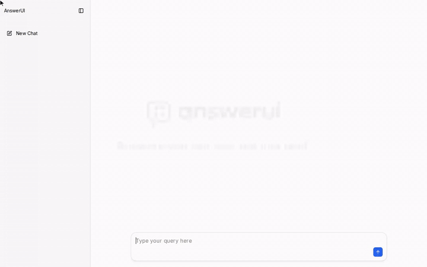

<p align="center">
  <picture>
    <source media="(prefers-color-scheme: dark)" srcset=".github/assets/logo-dark.png">
    
  </picture>
</p>

<p align="center">
  <strong>Answers you can use, not just read.</strong> Open source, any AI model.
</p>

<p align="center">
  <a href="https://github.com/0xcro3dile/answerui/actions/workflows/ci.yml"></a>
  <a href="LICENSE"></a>
</p>

---

AnswerUI is an open-source alternative to ChatGPT's Intelligent UI. It replies with interfaces
instead of walls of text: charts, forms, tables and calculators you can use right in the answer.
It works with any OpenAI-compatible model, in the cloud or on your own machine.

<p align="center">
  
</p>

<p align="center"><a href=".github/assets/demo.mp4">Watch the demo in full quality</a></p>

## Quick start

```bash
npx answerui-app
```

The first run asks for your API key. Press Enter instead to use a local model with
[Ollama](https://ollama.com).

<details>
<summary>Docker</summary>

```bash
docker run -p 127.0.0.1:3000:3000 --env-file .env ghcr.io/0xcro3dile/answerui
```

</details>

<details>
<summary>From source</summary>

```bash
git clone https://github.com/0xcro3dile/answerui.git
cd answerui
pnpm install
pnpm dev
```

</details>

## Models

Set these in your environment, or save them with `npx answerui-app --setup`:

| Variable                 | What it does                                                           |
| ------------------------ | ---------------------------------------------------------------------- |
| `OPENAI_API_KEY`         | Your API key                                                           |
| `OPENAI_BASE_URL`        | Your provider's API address (default: OpenAI)                          |
| `OPENAI_MODEL`           | The model to use                                                       |
| `OPENAI_EXTRA_BODY`      | Extra JSON sent with each request, e.g. to turn off a model's thinking |
| `OLLAMA_HOST`            | Where Ollama runs (default: `localhost`)                               |
| `ANSWERUI_ALLOWED_HOSTS` | Extra hostnames to serve, for example behind a proxy                   |

| Provider        | `OPENAI_BASE_URL`                |
| --------------- | -------------------------------- |
| OpenAI          | leave empty                      |
| OpenRouter      | `https://openrouter.ai/api/v1`   |
| Kimi (Moonshot) | `https://api.moonshot.ai/v1`     |
| Groq            | `https://api.groq.com/openai/v1` |
| LM Studio       | `http://localhost:1234/v1`       |
| Ollama          | leave everything empty           |

Bigger models build better interfaces. With Ollama, start it with `OLLAMA_CONTEXT_LENGTH=16384`.

## Privacy

AnswerUI has no telemetry. Your messages go only to the provider you choose, your key stays on
your machine, and the app only answers requests from your own computer.

## Credits

Built on [OpenUI](https://github.com/thesysdev/openui) (MIT). Not affiliated with OpenAI.

## License

[MIT](LICENSE)
